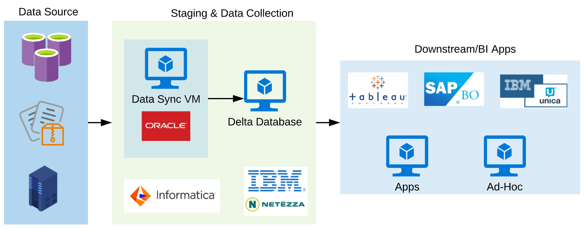

# Netezza to RedShift Migration - Lite Version

This is a lite version of our official blog of the IBM Netezza to RedShift migration case study, since the blog post is a long one, so prepared this to give you an idea, changes faced and their solution.

**Main Blog Link:** [https://medium.com/searce/case-study-migrating-a-giant-netezza-warehouse-to-aws-redshift-fe41391e2f65](https://medium.com/searce/case-study-migrating-a-giant-netezza-warehouse-to-aws-redshift-fe41391e2f65)

## On-prem Architecture:



## Migration Plan:

Once we validated the RedShift comfortability, we have finalized the migration approach.


Inspired by AWS blog :)

- [AWS SCT](https://docs.aws.amazon.com/SchemaConversionTool/latest/userguide/CHAP_Welcome.html) — Convert the Netezza schema to RedShift.
- [Snowball Edge](https://docs.aws.amazon.com/snowball/latest/ug/whatissnowball.html) — Move the historical data to S3 Bucket.
- [SCT Data Extraction Agents](https://docs.aws.amazon.com/SchemaConversionTool/latest/userguide/agents.html) — Extract the data from Netezza to Snowball.
- [Direct Connect](https://aws.amazon.com/directconnect/) — (Already implemented) Delta data sync from data sources to RedShift.
- [EC2](https://aws.amazon.com/ec2/) — Host all the downstream apps.
- [RDS](https://aws.amazon.com/rds) — Backend databases for downstream apps.

### Schema Conversion:

1. SCT tool added the zstd compression to all the int and date/timestamp data types. But AZ64 is recommended. 
2. In RedShift varchar(10) means it can hold 10 single byte characters, Special symbols are more then one byte, so we need to extend the column value range.

### Row Count & KPI:

1. Take the row count of all the tables before the export from using `select count (*)` Getting the data from the system table, may give you a stale data.
2. Make sure no writes during the row count calculation.
3. Run some important KPI and get the values.

### SCT & and Data Export:

1. Use some higher instance type and multiple SCT extraction agent.
2. Use virtual partitioning.
3. Netezza has slice concept, so you can use datasliceid column for the virtual partition.
4. Skip the archive data, temp tables and testing table to save time on data export. Later you can directly export to S3 without snowball.

### Data Validation on Snowball:

1. SCT export tasks will give you the log files. 
2. You can run the below command on a linux server, or use linux utilities on windows to get the exact number of rows exported from the Netezza.

```sql
grep -o -P 'completed, processed.{0,9}' * | cut -f3- -d ' ' | awk 'BEGIN {total=0;}{total+=$1;}END {print "Total: ",total}'
Total:  210270441
```

### Import to RedShift:

1. Script your data import.
2. Small chunks will help you to load faster.
3. During the historical load, just increase the cluster size.
4. Once the data import done, then run the vacuum and analyze commands.

### Data validation on RedShift:

1. Get the row count of all the tables and compare with the Netezza row count(remember, we took the netezza row count before the export)
2. Run the KPIs on RedShift and compare the results with Netezza KPI.

### Delta data sync:

1. Created some ETL packages to sync the Delta data.
2. Merge and cleansed the delta data with RedShift.
3. Keep doing the validation with current Netezza data.
4. Scheduled the data sync between the Netezza and RedShift.

### Post Migration:

1. Test all the reports
2. Users list
3. Network access
4. ETL window timing

### Table design issues:

1. Sort keys - needs to be created after understanding the query pattern, RedShift admin scripts will help you to find the right candidate. ([Link 1](https://medium.com/r/?url=https%3A%2F%2Fgithub.com%2Fawslabs%2Famazon-redshift-utils%2Fblob%2Fmaster%2Fsrc%2FAdminScripts%2Fpredicate_columns.sql), [Link 2](https://medium.com/r/?url=https%3A%2F%2Fgithub.com%2Fawslabs%2Famazon-redshift-utils%2Fblob%2Fmaster%2Fsrc%2FAdminScripts%2Ffilter_used.sql))
2. [Don't compress the sort key columns.](https://medium.com/r/?url=https%3A%2F%2Fthedataguy.in%2Fredshift-do-not-compress-sort-key-column%2F)
3. Tune the WLM settings.
4. Schedule the Vacuum and analyze processes.
5. Choose the right instance type.

### Other issues & Solutions:

1. There is no setting for server level timezone, so set it on [user level.](https://medium.com/r/?url=https%3A%2F%2Fdocs.aws.amazon.com%2Fredshift%2Flatest%2Fdg%2Fr_timezone_config.html)
2. If you want more float digits, then use [extra_float_digit](https://medium.com/r/?url=https%3A%2F%2Fdocs.aws.amazon.com%2Fredshift%2Flatest%2Fdg%2Fr_timezone_config.html) on the parameter group.
3. dived an INT column will give you the rounded result, if you want the exact numbers then [cast that column to float](https://medium.com/r/?url=https%3A%2F%2Fdocs.aws.amazon.com%2Fredshift%2Flatest%2Fdg%2Fr_timezone_config.html).

### Further improvements:

1. Concurrency scaling
2. Spectrum.
3. Auto WLM.

### Lessons learned:

This was one of the huge enterprise projects. We have learned so many things with SCT and RedShift.

- Table design — If this goes wrong and everything is out of your hands.
- SCT — It will super awesome that it suggests the AZ64 and remove the encoding on the sort key column.
- If we chunk the data into multiple small pieces then it’ll give you better performance during the COPY process.
- Automatic backups for this much write-intensive cluster may end up with a lot of snapshots. Customizing this can give you some cost benefits.
- Script your data load will save more time in copy-pasting the COPY commands.
- Elastic Resize is not always possible, we had some bad experience(we implemented this immediately when the feature got introduced).
- During the DR drill, one of the zones was running out of capacity. So if you are automating the DR process add your retry condition with different zones.
- Restoring from the snapshot to a new cluster is always not smooth. Check the possible node types and the minimum number of nodes.

### Read more to manage the RedShift cluster:

1. [AWS RedShift Administrator Guide — Manage your Production Cluster](https://medium.com/searce/aws-redshift-administrator-guide-manage-your-production-cluster-c720cde43474)
2. [Introducing RStoolKit — RedShift Cluster Health Check and Optimization](https://medium.com/searce/diagnose-and-optimize-redshift-cluster-performance-with-rstoolkit-bd9ac2feb4bb)
3. [RedShift Elastic Resize — The Good And The Not-so-good](https://medium.com/searce/redshift-elastic-resize-the-good-and-the-bad-4d7e63d6533b)
4. [Audit RedShift Historical Queries With pgbadger](https://medium.com/searce/audit-redshift-historical-queries-with-pgbadger-619f7f43fbd0)
5. [Find Ghost Rows/Dead Rows For All The Tables In RedShift](https://thedataguy.in/find-ghost-rows-redshift/)
6. [Export RedShift System Tables And Views To S3](https://thedataguy.in/export-redshift-system-tables-views-to-s3/)
7. [Analyze RedShift user activity logs With Athena](https://thedataguy.in/analyze-redshift-useractivitylog-with-athena/)